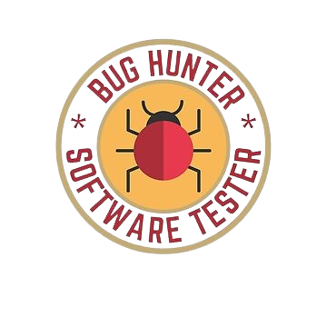

#    Hello world!!&nbsp; I'M Shaik Mohmd AFridi   Software Development Test Engineer  
  :octocat:

 
## &nbsp; About Me
- 😄 Pronouns: **He/Him**
-  Diligent engineering student with 1.5 years of hands-on QA and training experience, transitioning into software testing.
- Completed rigorous training in functional testing, automation, and Java programming.
-  Proficient in crafting meticulous test cases, defect tracking, and automation using Selenium and API testing.
- Dedicated to joining an ethical organization, aiming to ensure software quality and efficiency.
- Strong soft skills include attention to detail, effective communication, problem-solving, teamwork, leadership, and critical thinking.
-  Passionate about technology, automobiles, photography, and travel, eager to contribute enthusiasm and innovation to testing initiatives.
## 🛠Languages and Tools:</h3>

    
 

##  Other Stuff 
 -  -[Click Here](https://drive.google.com/file/d/1z-8n8RHtP3VueicBMiuag4O5ft95c9Vr/view?usp=sharing) To view my **Resume**
  - If you have any suggestions to this README, feel free to pull up a request. And if you liked it, go ahead and use it for yourself.

 

 

 

